# Max Anderson - RDSI Capstone 2 Project 
## Classifying Nintendo 64/PlayStation Textures with Convolutional Neural Networks

### PROJECT DESCRIPTION
- Attempt to use **Convolutional Neural Networks** in order to classify image
textures from **Nintendo 64 games** by use in game development or game
modding
- Images are taken from popular modding resource [smwcentral.net](https://www.smwcentral.net/)
- Data was **hand labeled** into what I consider to be the most useful categories
based on personal experience
- Three **CNN models** were successfully trained and compaired based on
accuracy

### PROJECT SCOPE
- **Pre-capstone:** Finding data, data cleaning
- **Day One:** Labeling, image generation, baseline model prelim
- **Day Two:** Labeling, baseline model work, building other models, callbacks
- **Day Three:** Tuning hyperparameters, refining callbacks, Google CoLab
setup
- **Day Four:** Generating graphs and visuals, presentation work
- **Day Five:** Presentation refinement and rehearsal, Github

### DATA ORGANIZATION
- Around 17,000 .png and .bmp images were taken from [smwcentral.net](https://www.smwcentral.net/)
- Most images were 32x32 pixels in RGBA colorspace
- Around 5,000 images were successfully labeled into 15 categories:

- Backgrounds

    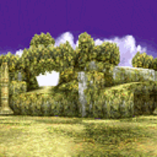

- Bricks/Masonry

    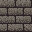

- Characters

    

- Cutscenes

    

- Design Patterns

    

- Terrain/Earth

    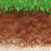

- Effects

    

- Metal

    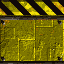

- Natural Patterns

    

- Objects

    

- Portraits

    

- UI/HUD

    

- Text

    

- Water

    

- Wood

    

### DATA ISSUES
- Hand labeling is time intensive and inconsistent
- Unbalanced labels
- Differences in artistic style between games
- Differences in texture utility between games
- Low resolution prevented the use of some CNN models (Inception)
- Small set of images limits amout of epochs, steps per epochs and validation
steps

### MODEL SUMMARIES
- Used **simple sequential model** with 2 convolutional layers as baseline
- Used **deeper sequential model** with more layers as intermediate
- Used **ResNet 34** model as best performing model
- Attemped an **Inception** model, but did not work with the low resolution
RGBA images

- CNN Diagram

    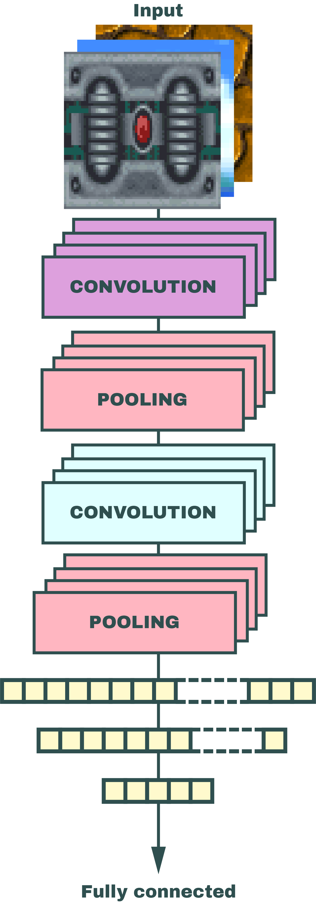

- Resnet34 Diagram

    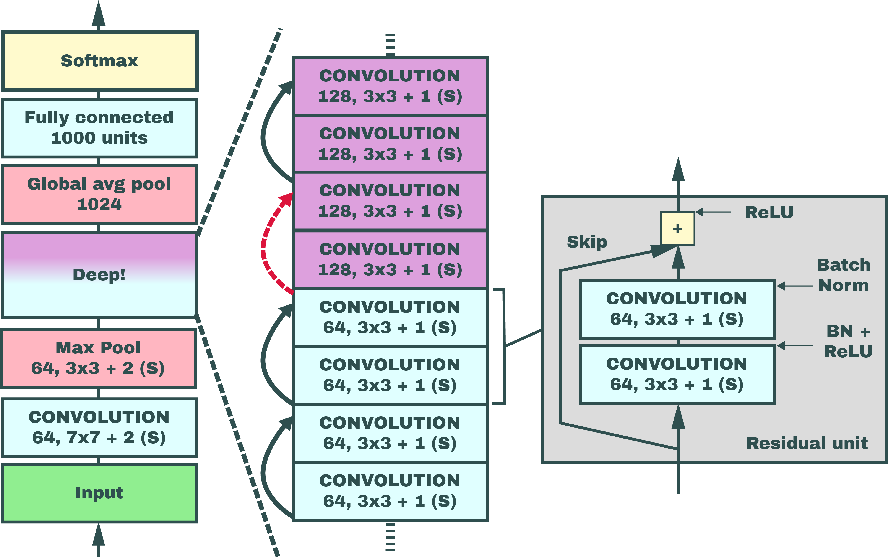

### ACCURACY SCORES

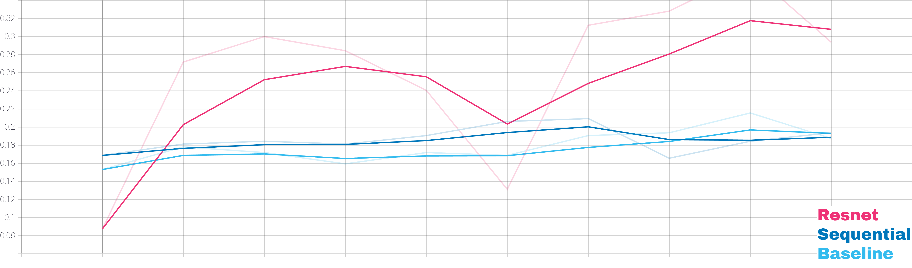

- 80 epochs
- 10 epoch steps
- 10 validation steps

- **Baseline accuracy**: 0.19
- **Sequential accuracy**: 0.2
- **ResNet accuracy**: 0.32

### RESNET CONFUSION MATRICES
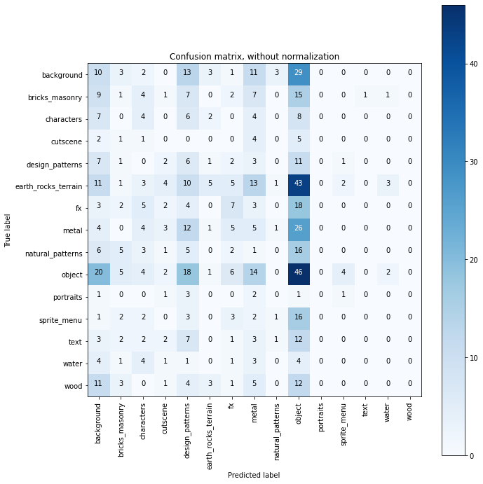

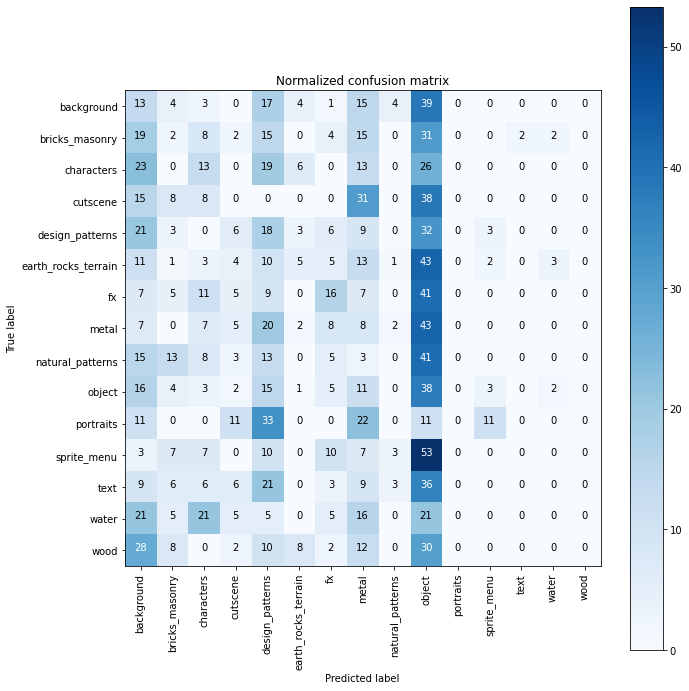

### PREDICTION SAMPLES

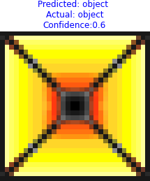

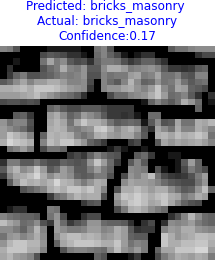

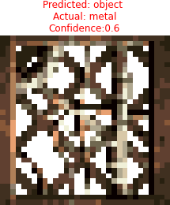

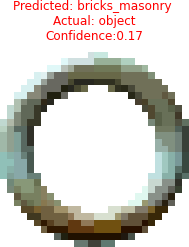

### NEXT STEPS
- Find a comparable CC0 or open source set of image textures
- Reassess categories
- Try more advanced models (pretrained models)
- Generate new image textures from trained models

### INITIAL PROJECT PROPOSALS
1. **Image Texture Classification:** My first proposal for capstone 2 is to initiate a model for image multi-classification of images intended for texturing 3D models. I plan to scrape a large group of image textures from various sources on the web and classify them by use-case ie. terrain, wood, architectural, character, etc. Places I’ve found where I can draw these images from are:
    - [Texture Haven](https://texturehaven.com/textures/)
    - [Texture-Resource](https://www.textures-resource.com/)  
    - [SMW Central](https://www.smwcentral.net/?p=section&s=sm64textures)
2. **Facial Detection Classification:** Another idea I had for capstone 2 is to create and train a model to determine if an image of a human face is real or fabricated using 3 image sets: One of drawings of human faces, one of computer generated faces, and the third of photographs of real human faces.
   - [CG faces](https://www.kaggle.com/allexmendes/synthetic-gaze-and-face-segmentation)
   - [Anime faces](https://www.kaggle.com/soumikrakshit/anime-faces)
   - [Real faces](https://www.kaggle.com/atulanandjha/lfwpeople)
3. **Animal Image classification:** My last proposal is to build another image classification model around a dataset of images of animal faces, classifying them under various contexts like predator/prey, mammal/reptile/amphibian/bird,etc.
    - [Animal faces](https://www.kaggle.com/andrewmvd/animal-faces)
